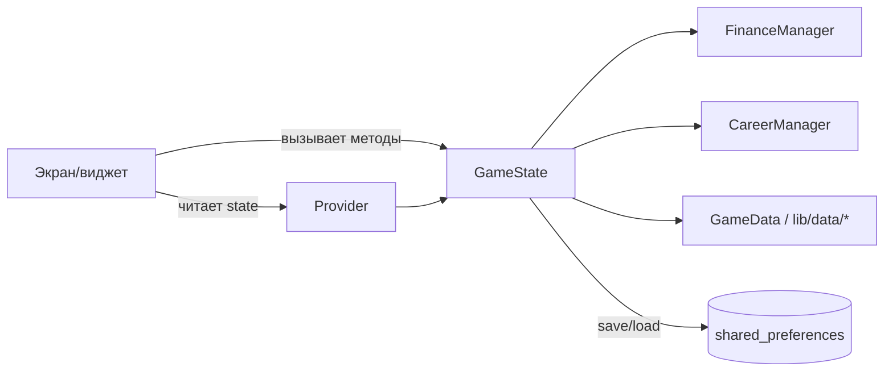

# Архитектура Pixel Life Simulator

Этот документ описывает структуру приложения и основные потоки данных/состояния.

## Обзор

Проект — Flutter-приложение на Dart. Игровая логика и состояние сосредоточены в `GameState` (`lib/app_state.dart`) и доступны UI через Provider (`ChangeNotifier`).

## Высокоуровневая схема

## Слои и ответственность

### UI

- **Экраны**: `lib/screens/`
  - показывают состояние и вызывают методы `GameState`
- **Виджеты**: `lib/widgets/`
  - переиспользуемые элементы интерфейса, диалоги событий и блоки сводки
- **Тема и роутинг**: `lib/main.dart`, `lib/ui_theme.dart`

### Состояние и доменная логика

- **`GameState`** (`lib/app_state.dart`)
  - “единственный источник правды” для текущего прогресса (день/месяц, настроение, баллы, инвентарь)
  - управляет фазами игры (планирование, ход, события, завершение месяца)
  - применяет финансовые эффекты событий/покупок и валидацию (например, ограничения настроения)
  - отвечает за сохранение/загрузку прогресса

- **Менеджеры домена** (`lib/domain/managers/`)
  - `FinanceManager`: балансы по “счетам”, распределение, подсчёт общей суммы
  - `CareerManager`: выбранная работа, история, курсы, доступные вакансии

### Данные и контент

- **Данные**: `lib/data/`
  - фиксированные наборы: профессии, курсы, цели, мерч, события
- **Модели**: `lib/models/`
  - структуры данных и перечисления, (де)сериализация

## Поток инициализации

1. `main()` создаёт `GameState` и вызывает `loadFromDisk()`.
2. `GameState` кладётся в Provider: `ChangeNotifierProvider`.
3. Экраны читают состояние и подписываются на обновления через `notifyListeners()`.

## Навигация

Маршруты задаются в `MaterialApp.routes` (`lib/main.dart`). Основные экраны:

- главное меню
- выбор работы
- игра (ходы/события)
- планирование (распределение бюджета/цель)
- магазин
- сводка месяца

## Игровой цикл (высокоуровнево)

- **Старт/переход месяца**: выбор работы/цели и распределение бюджета.
- **Ходы**: `nextTurn()` увеличивает дни и может триггерить:
  - обязательные платежи
  - предложения переработок
  - квизы (ограниченно по месяцу)
  - случайные/добровольные события
- **Конец месяца**: проверка достижения цели и победы/поражения.

Точные правила см. `docs/gameplay.md`.

## Инварианты и “острые углы”

- **Настроение** зажимается в диапазон 0…100 и при падении до 0 приводит к поражению.
- **День месяца** ограничен 1…30. При достижении конца месяца фиксируется результат.
- **Дефицит платежа** хранится как `PendingTransaction`/`PendingPayment` и должен быть закрыт до продолжения.

## Сохранение прогресса

Сохранение делается локально через `shared_preferences`:

- ключ: `game_state`
- формат: JSON, формируется из `GameState.toJson()`

Операции сохранения вызываются после важных изменений (распределение, выбор, событие, покупки и т.д.).

### Что именно сохраняется

В state сохраняются, среди прочего:

- день/месяц, настроение, баллы
- выбранная цель и прогресс по накоплениям
- балансы по категориям и параметры распределения
- текущие/отложенные события и история событий
- инвентарь мерча, история работ, пройденные курсы

## Где что менять

- **Логику событий**: `lib/app_state.dart` + данные в `lib/data/events_data.dart` / `lib/data/game_data.dart`
- **Баланс/распределение**: `lib/domain/managers/finance_manager.dart`
- **Карьеру/условия вакансий**: `lib/domain/managers/career_manager.dart` + `lib/data/jobs_data.dart`
- **UI конкретного экрана**: соответствующий файл в `lib/screens/`
- **Диалоги/компоненты**: `lib/widgets/`
