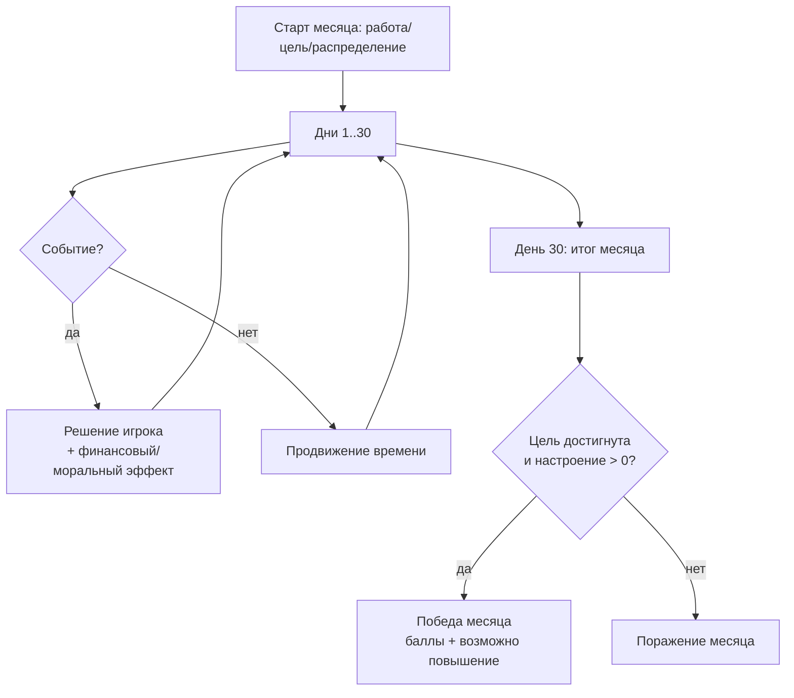

# Правила игры (Gameplay)

Этот документ описывает основные механики Pixel Life Simulator на уровне правил, а не реализации UI.

## Цель игрока

За месяц (30 игровых дней) прожить события и финансовые решения так, чтобы:

- **накопить на выбранную цель**, и
- **не “обнулить” настроение** (оно не должно упасть до 0).

Если по итогам месяца цель достигнута и настроение положительное — месяц считается успешным (победа), игрок получает **игровые баллы**.

## Базовые сущности

- **Работа**: определяет зарплату и “уровень” (tier).
- **Цель**: стоимость, ежемесячный вклад, награда в баллах.
- **Настроение**: показатель от 0 до 100, влияет на риск/предпочтение событий и возможность карьерного роста.
- **Балансы**:
  - кошелёк (свободные траты),
  - отложенные,
  - обязательные,
  - накопления на цель.

## Структура месяца

## Старт месяца

В начале месяца игрок выбирает:

- **работу** (зарплата зависит от выбранной профессии),
- **цель** (и ежемесячный вклад),
- **распределение бюджета** по категориям.

После старта можно перейти в игровой цикл “ходов”.

### Бюджет и распределение

Распределение задаёт “план” по категориям, но фактические балансы зависят от текущего доступного объёма денег. Логика перераспределения и подсчётов реализована в `FinanceManager` и `GameState`.

## Ходы и дни

Один “ход” может продвинуть время на несколько дней. Внутри дня могут происходить:

- обязательные платежи (аренда, коммунальные, транспорт и т.п.);
- образовательные квизы;
- случайные/добровольные события;
- предложения переработок при дефиците денег перед платежами.

### Обязательные платежи

В течение месяца есть фиксированные дни с обязательными платежами (например, аренда и услуги). Платежи относятся к типу `payment`.

Варианты решения:

- **оплатить сейчас**: списание из “обязательных” средств, небольшой бонус к настроению
- **отложить**: платеж попадёт в список ожидающих и вернётся позже с ухудшением настроения

### Квизы

Квизы появляются в определённые дни (по данным игры) и ограничены по количеству на месяц.

- при правильном ответе: награда (деньги/баллы/настроение),
- при неправильном: штраф по настроению.

Квизы — это часть образовательного блока: они дают короткую проверку знаний и помогают игроку “отбить” часть негативных событий.

### События

События бывают:

- **random** — случайные, с финансовым и/или эмоциональным эффектом;
- **voluntary** — добровольные, игрок решает принимать или отказаться;
- **payment** — платежи (оплатить сейчас или отложить с последствиями).

События могут иметь ограничения по повторению (история событий).

## Обязательные траты и дефицит

Некоторые расходы идут из “обязательного” баланса. Если денег не хватает:

- создаётся “дефицит” и игроку предлагается закрыть его из другого источника (в зависимости от контекста).
- если закрыть дефицит невозможно — игра может закончиться поражением.

### Переработка (overtime)

Если скоро платежи, а денег мало, игра может предложить переработку: это быстрый способ получить деньги ценой ухудшения настроения.

## Настроение

- находится в диапазоне 0…100,
- при падении до 0 игра заканчивается поражением,
- высокий уровень может повышать шансы на позитивные исходы/карьерные возможности (и наоборот).

### “Управление риском”

В игре часто приходится выбирать между:

- немедленным финансовым выигрышем и потерей настроения,
- более “дорогим”, но спокойным вариантом,
- отсрочкой платежа (с риском ухудшения ситуации).

## Карьера и рост

В течение игры можно менять работу. Доступность вакансий зависит от:

- текущей выбранной работы и её уровня (tier),
- истории профессий (опыт),
- пройденных курсов (если для профессии указан requiredCourse),
- “готовности к повышению” (например, после успешного месяца при хорошем настроении).

## Курсы

Курсы покупаются за “отложенные” средства и открывают новые карьерные ветки/вакансии.

## Магазин мерча

За **игровые баллы** можно покупать предметы мерча. Баллы начисляются за успешные месяцы и некоторые активности (например, квизы).

## Сохранения

Прогресс сохраняется локально на устройстве. Обычно после значимых действий (покупка, событие, перераспределение, ход).

## Баланс и настройка контента

Если вы редактируете данные в `lib/data/`, удобно придерживаться принципов:

- **платежи** должны быть ощутимыми, но не “ломать” игру без вариантов решения;
- **награды** за квизы/переработку не должны полностью нивелировать негативные события;
- **курсы/карьера** должны давать понятную траекторию роста дохода.

## Где искать правила в коде

Если нужно уточнить “точно как считается”:

- основной игровой цикл: `lib/app_state.dart`
- финансы: `lib/domain/managers/finance_manager.dart`
- карьера: `lib/domain/managers/career_manager.dart`
- данные (профессии/цели/события): `lib/data/`
